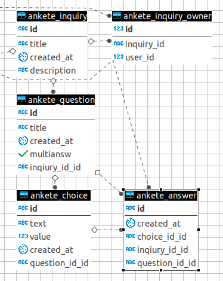

# Ankete

Service for people who wants to create questionnaire
and get data after.

## How it should work (warning: not all features are implemented yet!)
After creator registers and creates questionnaries, it gets published one the site and anyone can pass this questionnaire without registration. At the same time creator watches results in his admin panel. What a wonderful world.

## How models looks like?

## Where is the front?
Any help with front is needed.